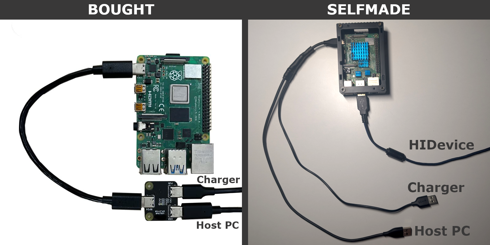

<p align="center">
  
</p>
<h1 align="center">hid-proxy</h1>

<p align="center">
    
    
    
    
</p>

**hid-proxy** is a lightweight USB HID proxy designed for the Raspberry Pi. It sits between a USB device and a Host PC, allowing you to intercept, log, and manipulate HID packets in real-time using **Rhai** scripts.

## 🪄 Use cases
This project acts as the framework to enable creative USB HID manipulation including...
* **Reverse Engineering:** Analyze and decipher the protocols of proprietary HID devices in real-time.
* **Pentesting:** Deploy advanced keyloggers, clone device identities (VID/PID), or inject keystrokes (BadUSB/Rubber Ducky) with complex hardware triggers.
* **Driver development:** Test OS stability by injecting corrupted or boundary-case values into device reports.
* **Hardware Firewall:** Block specific malicious packets or unknown device descriptors before they reach the host.
* **Hardware-Level Macros:** Add macro capabilities to "dumb" devices, such as anti-recoil scripts for gaming or productivity shortcuts, independent of the host OS.
* **Cross-Device Interaction:** Trigger mouse clicks via keyboard presses or vice versa.
* **Undetectable Anti-AFK:** Keep sessions active with subtle, randomized mouse micro-movements (Mouse Jiggler) to comply with corporate activity monitoring.
* **Assistive Technology:** Implement real-time input smoothing algorithms (e.g., moving averages) to counteract hand tremors for users with motor impairments.
* **Custom Input Devices:** Remap unconventional hardware (like foot pedals or custom knobs) to act as standard keyboards or mice.

## ⚠️ Hardware Requirements

This tool is specifically tested on **Raspberry Pi 4 and 5**.
* **Pi 3:** Likely works but untested.
* **Pi Zero:** **Not supported.**

### The Wiring Setup
To use the Raspberry Pi 4/5 as a USB Gadget while maintaining sufficient power, you must use a **USB-C Y-Cable** (splitter) on the Pi's power/data port.

There are two ways to get the required splitter. You can either
[buy one](https://www.google.com/search?q=pikvm+usb%2Fpwr+splitter&tbm=shop), or
[build it](https://www.tnt-audio.com/clinica/221_diy_usb_e.html) yourself.




## ⚡ Getting Started

### 1. System Setup (OS Configuration)
Before running the software, you must configure the Raspberry Pi kernel to support USB Gadget mode.

1.  **Enable the DWC2 controller:**
    Edit `/boot/firmware/config.txt` (or `/boot/config.txt` on older OS versions):
    ```bash
    sudo nano /boot/firmware/config.txt
    ```
    Add this line to the bottom:
    ```ini
    dtoverlay=dwc2
    ```

2.  **Load required modules:**
    Edit `/boot/firmware/cmdline.txt` (or `/boot/cmdline.txt`):
    ```bash
    sudo nano /boot/firmware/cmdline.txt
    ```
    Append the following text to the end of the line (ensure it remains **one single line**, do not add newlines):
    ```text
    modules-load=dwc2,libcomposite
    ```

3.  **Reboot the Pi:**
    ```bash
    sudo reboot
    ```

### 2. Installation

*Note: This project is currently in early development. Pre-built binaries will be available later.*

1.  Clone the repository:
    ```bash
    git clone [https://github.com/EiSiMo/hid-proxy.git](https://github.com/EiSiMo/hid-proxy.git)
    cd hid-proxy
    ```
2.  Build and run using Cargo:
    ```bash
    cargo run --release
    ```

### 3. Usage
1. The most essential command for development is:

    ```bash
    sudo ./target/release/hid-proxy -s monitor
    ```
This command displays the raw data coming from the HID device, which is useful for developing your own Rhai scripts.

## 📜 Scripting with [Rhai](https://github.com/rhaiscript/rhai)

The core logic is handled by Rhai scripts found in the `examples/` directory. You can modify data on the fly without recompiling the binary.

### The `process_data` Hook

Your script must implement the following function:
]
```rust
// direction: "IN" (to host) or "OUT" (from host)
// data: Array of bytes [u8]
// returns: Array of bytes [u8] (modified or original)

fn process_data(direction, data) {
    // Example: Log traffic
    print(`[${direction}] Packet length: ${data.len()}`);

    // Example: Manipulate data (e.g., swap a byte)
    if direction == "IN" && data[0] == 0x01 {
        data[1] = 0xFF;
    }

    return data;
}
